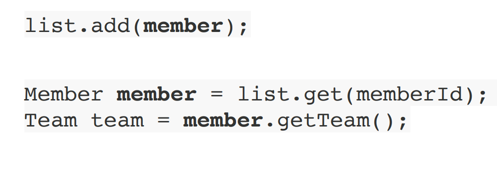
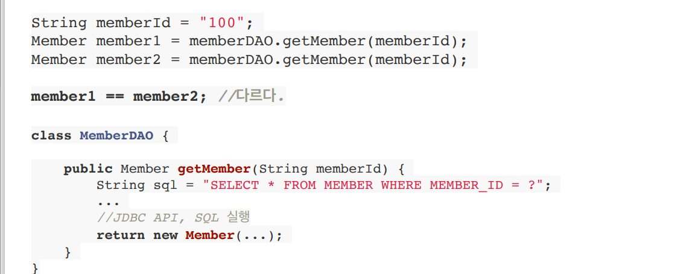
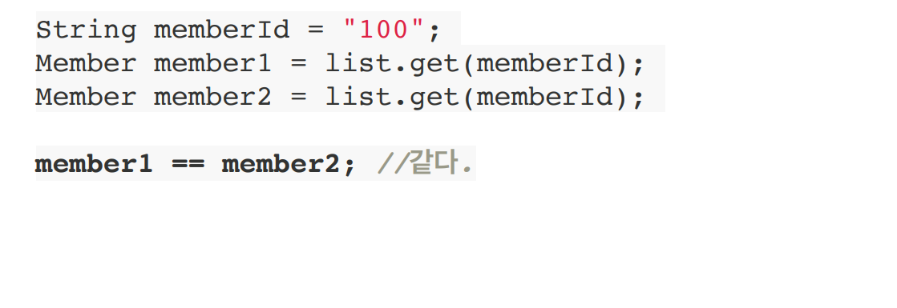

# JPA의 등장  
### -기존에는 SQL 중심적 개발
#### > 문제점: 매핑 작업이 오래 걸림, 테이블 구조 변경시 코드의 모든 SQL문 변경된 테이블 구조에 맞게 수정    
### -이러한 SQL 중심적 개발을 피하기 위해 객체랑 관계형DB를 매핑하는 JPA를 사용
#### >왜 객체랑 관계형DB를 매핑 해줘야되는가?  
</img> 
-위의 그림에 보이듯 자바 컬렉션은 간단하게 저장하고 사용 할 수 있는걸 알수있다.  

</img>   </img> 
-위에 그림이 SQL을 이용한 경우고 아래 그림이 자바컬렉션에 저장한 경우다.    

__SQL을 이용할 경우 새로운 객체를 매번 생성해줘야되는 반면
자바컬렉션에서는 객체를 계속 생성하는 것이 아닌 기존에 있던 것을 똑같이 가져온다.__
그래서 자바컬렌션에 저장하듯 데베에 저장해줘야 성능이 좋아지고 유지보수가 효율적이게 된다.

## 이러한 JPA를 왜 사용해야 하는가?
#### - SQL 관련된거는 JPA가 다 처리하여 개발자의 불필요한 작업시간을 줄일수 있다.
#### - 생산성과 유지보수가 효율적이다.
#### - 패러다임의 불일치 문제를 해결해준다.
